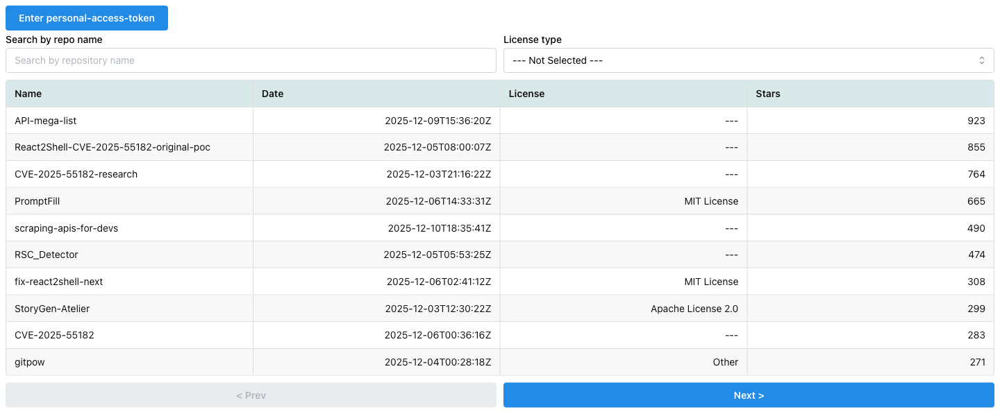
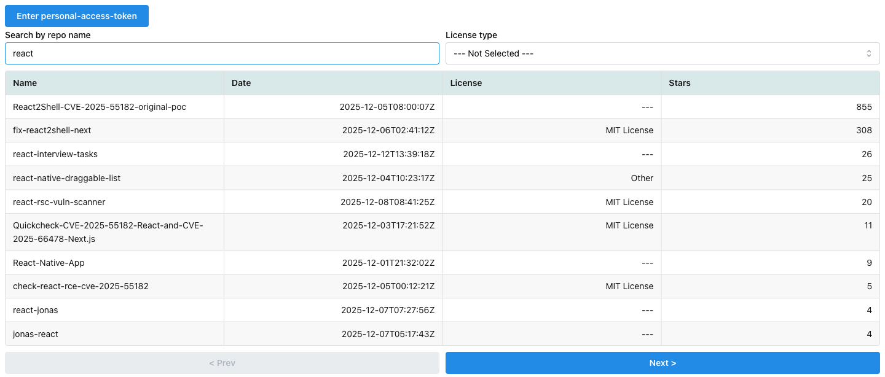
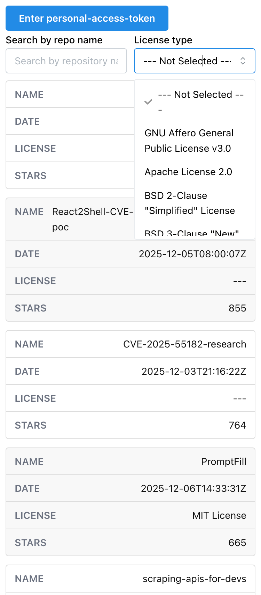

# Gravity portfolio in an Nx monorepo

## Getting Started

The portfolio app lives in `apps/main` and is built with React, Vite, TypeScript, Tailwind CSS, and Nx. Review the [Repository Guidelines](AGENTS.md) for project structure and contribution expectations. For workflow details, see the [Contributing Guide](CONTRIBUTING.md) and [Security Policy](SECURITY.md).

### Prerequisites

```sh
bun install
```

### Development

Start the app with:

```sh
bun run dev
```

Open http://localhost:3000/. The portfolio app does not require API credentials or GraphQL code generation.

### Examples

- [GitHub repository list](https://dipiash.github.io/nx-vite-react-ts-mantine-boilerplate/)

### App screenshots

#### Desktop version





#### Mobile version



### Features

- [Nx 22](https://nx.dev)
- [React 19](https://reactjs.org)
- [Tailwind CSS 4](https://tailwindcss.com/)
- React Router
- [Storybook 10](https://storybook.js.org/)
- [TypeScript](https://www.typescriptlang.org/)
- [Vite 8](https://vitejs.dev/)
- [Vitest](https://vitest.dev/)
- [ESLint](https://eslint.org/)
- HMR (Hot Module Replacement)

## License

This code is licensed under the MIT License.
You can find the license file [here](/LICENSE).
